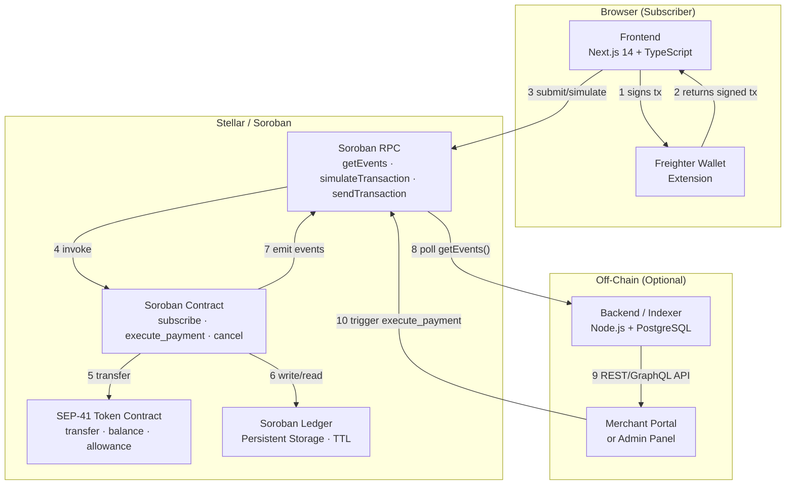
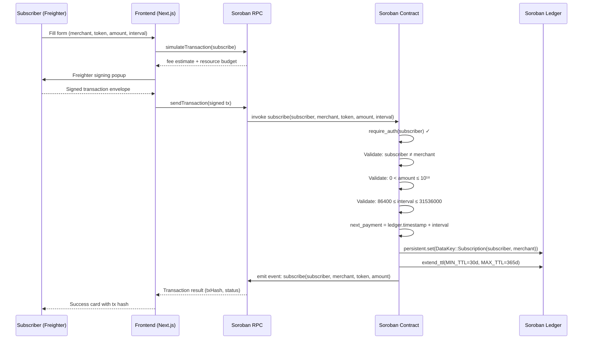
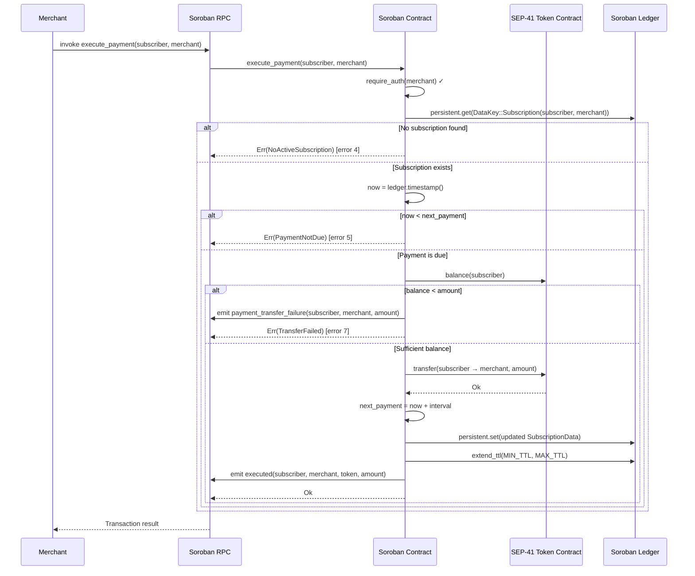
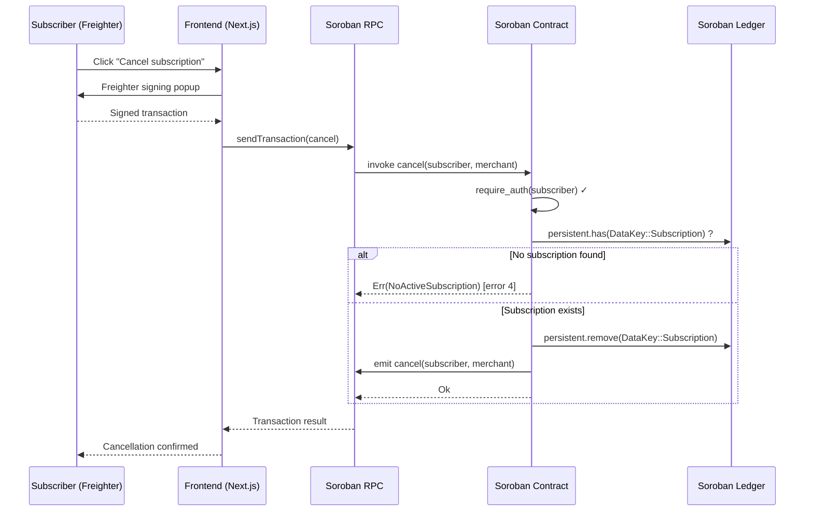
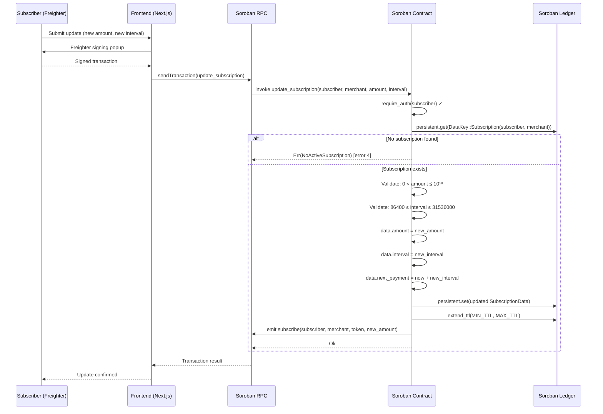
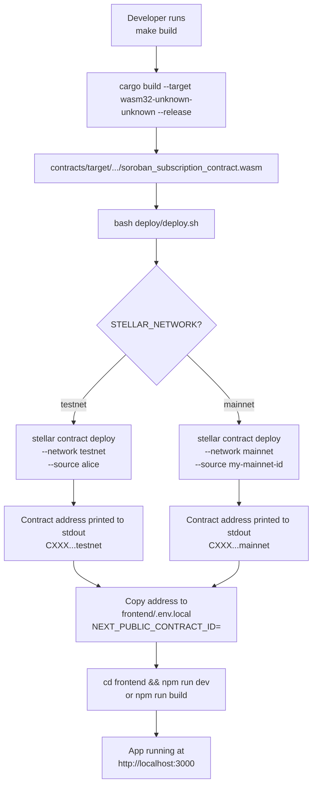
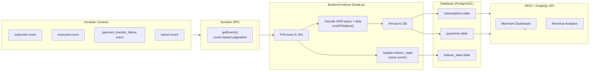
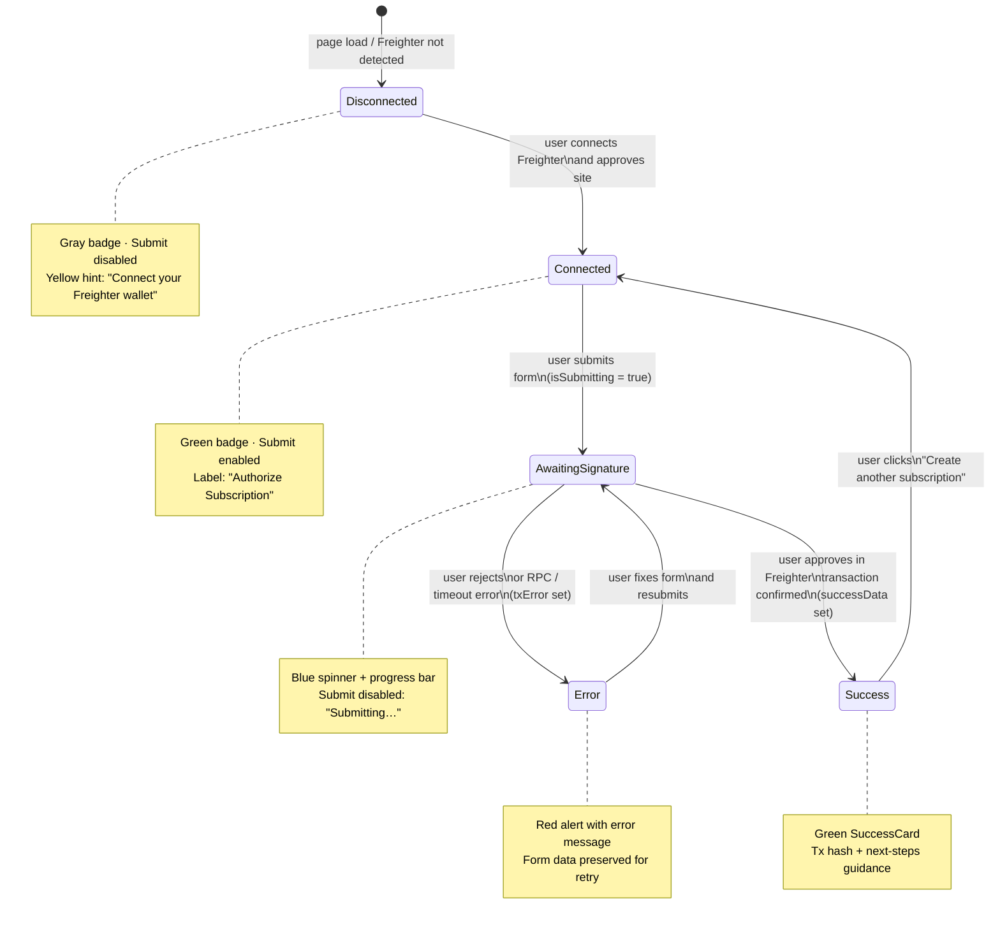

# Architecture Workflow Diagrams

Visual diagrams for SorobanPay's system architecture, transaction flows, deployment pipeline, and event indexing. All diagrams use [Mermaid](https://mermaid.js.org/) syntax and render natively in GitHub, GitLab, and most Markdown previewers.

For the written architecture description and storage/event schemas see [docs/architecture.md](./architecture.md).

---

## Table of Contents

1. [System overview](#1-system-overview)
2. [Subscribe flow](#2-subscribe-flow)
3. [Execute payment flow](#3-execute-payment-flow)
4. [Cancel flow](#4-cancel-flow)
5. [Update subscription flow](#5-update-subscription-flow)
6. [Deployment pipeline](#6-deployment-pipeline)
7. [Event indexing flow](#7-event-indexing-flow)
8. [Wallet connection UX states](#8-wallet-connection-ux-states)

---

## 1. System overview

High-level component map showing all layers of SorobanPay and how they interact.

---

## 2. Subscribe flow

Detailed sequence: subscriber creates a new recurring payment agreement.

---

## 3. Execute payment flow

Merchant collects a due recurring payment from a subscriber.

---

## 4. Cancel flow

Subscriber terminates their subscription.

---

## 5. Update subscription flow

Subscriber updates the amount or interval of an existing subscription.

---

## 6. Deployment pipeline

How the contract is built, deployed, and connected to the frontend.

---

## 7. Event indexing flow

How an optional off-chain backend indexes contract events for merchant dashboards.

---

## 8. Wallet connection UX states

State machine for the `SubscriptionForm` component's wallet and transaction lifecycle.

